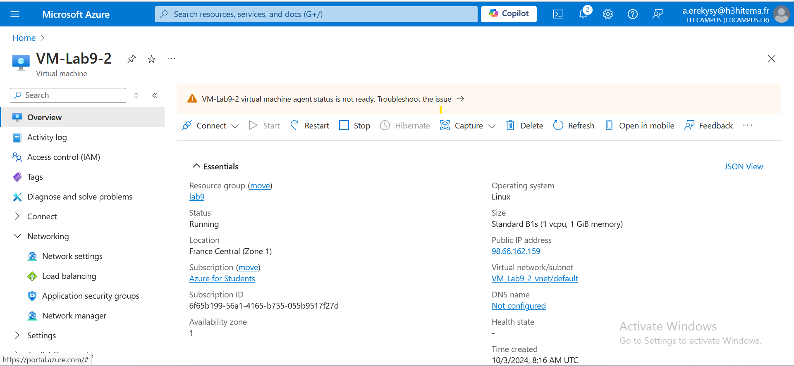
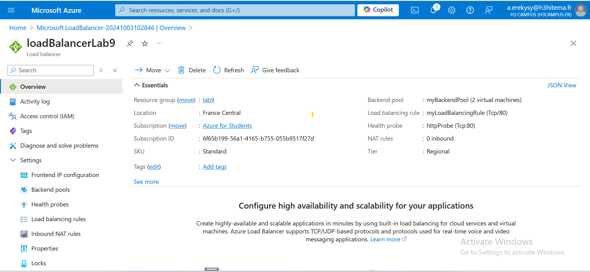

# Archi-Cloud-FINOPS-Course Lab9

## Step 1: Deploy Virtual Machines (VMs)

1. **Create Virtual Machines**:
   - In the Resource Group, click **Create a resource** and select **Virtual Machine**.
   
   

## Step 2: Deploy Azure Load Balancer

1. **Create a Load Balancer**:
   - In the Azure Portal, search for **Load Balancer** and click **Create**.

2. **Configure Frontend IP**:
   - After the Load Balancer is created, go to **Frontend IP configuration** and add a **Frontend IP** (a public IP).

3. **Create Backend Pool**:
   - Go to **Backend pools** and create a new backend pool.
   - Add the previously created VMs to this pool. This pool will define which VMs will receive traffic.

4. **Create Health Probes**:
   - Go to **Health probes** and create a new probe.
   - Specify the **protocol** (HTTP or TCP), **port** (80 or another port based on your application), and **intervals**.
   - Health probes allow the Load Balancer to monitor the health of the VMs.

5. **Configure Load Balancing Rules**:
   - Go to **Load balancing rules** and create a new rule.
   - Specify the **Frontend IP**, **Backend pool**, **Health probe**, and **Port**.
   - This rule defines how traffic is distributed across VMs.

   

## Step 3: Set Up Azure Traffic Manager

1. **Create a Traffic Manager Profile**:
   - In the Azure Portal, search for **Traffic Manager** and click **Create**.
   - Configure the following:
     - **Name**: Provide a name for your Traffic Manager profile.
     - **Routing Method**: Choose a routing method (e.g., **Priority** for failover, **Performance** for routing based on the closest region).
     - **Resource Group** and **Region**: Use the same as the VMs.

2. **Configure Endpoints**:
   - After creating the profile, go to **Endpoints** and add the **Public IP address** of the Load Balancer as an endpoint.
   - You can add multiple endpoints in different regions if you want to configure global routing.