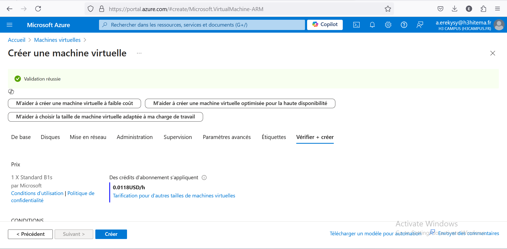
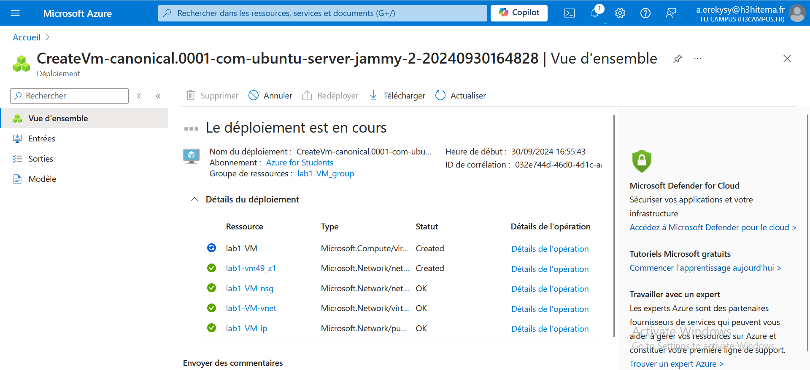
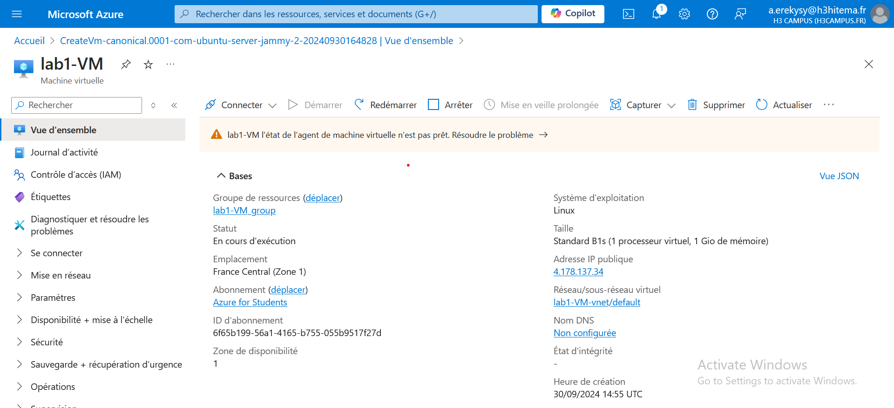
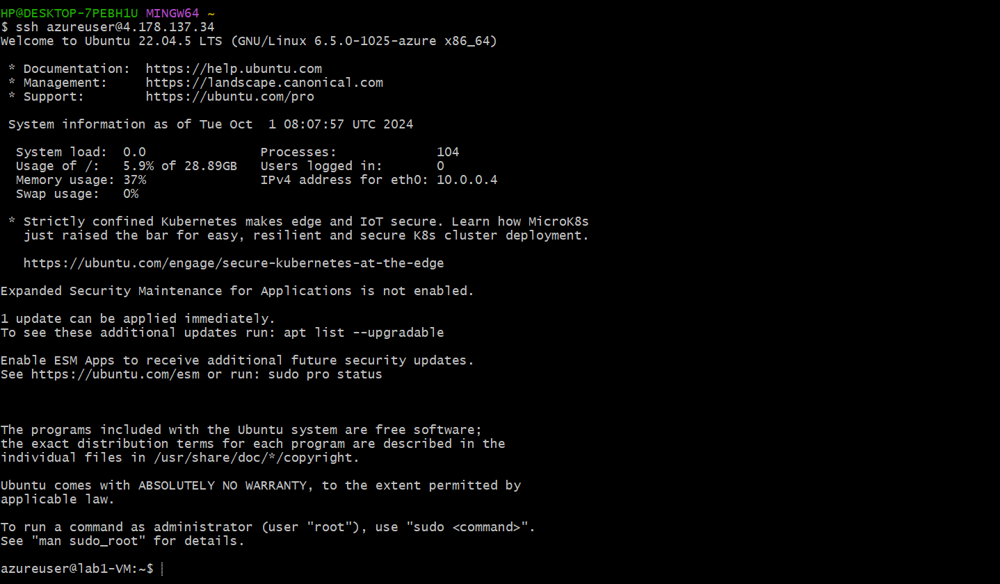
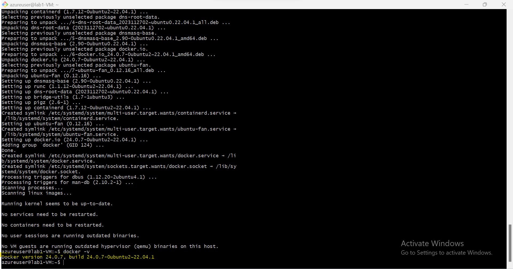
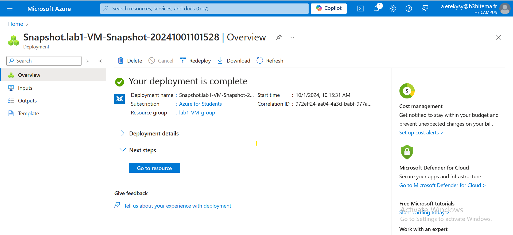

# Archi-Cloud-FINOPS-Course Lab1

## Steps

### 1. Deploy Linux VM





### 2. Connect to VM using SSH

1. Go to your VM's **Overview** in the Azure Portal and note the **Public IP Address**.
2. Use SSH to connect to the VM:
   ```bash
   ssh azureuser@<your-vm-public-ip>
   


### 3. Install Software (Docker)

1. execute this commande : 
    ```bash
    sudo apt install docker.io -y
 

### 4. Take SnapShot

1. Navigate to the Disks section in the Azure Portal.
2. Select the OS Disk of your VM and click on Create Snapshot.
3. Configure Snapshot Options:
    Name: Provide a name for the snapshot.
    Storage Type: Choose between Standard or Premium storage.
4. Click Create to save the snapshot. This snapshot will capture the state of your VM, allowing you to restore it later if needed.
 
