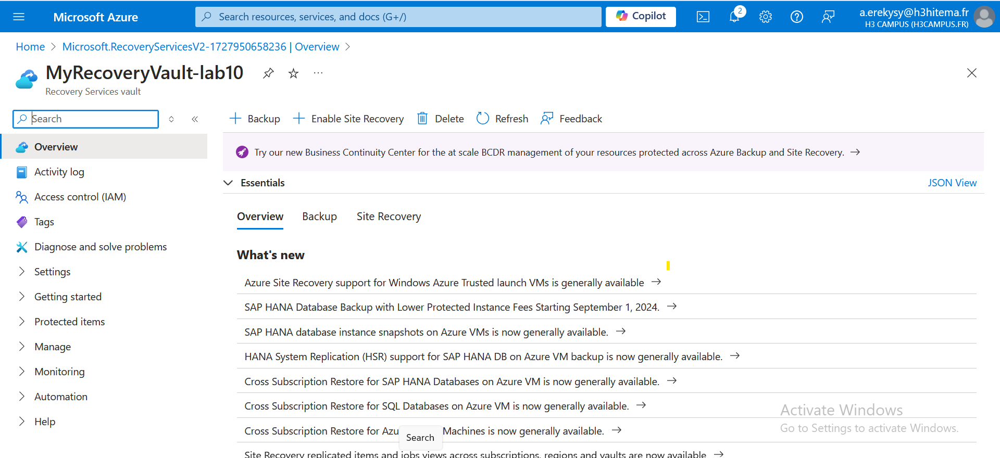

# Archi-Cloud-FINOPS-Course Lab10

## Step 1: Create a Recovery Services Vault

1. **Create a Recovery Services Vault**:
   - In the Azure Portal, click on **Create a resource** > **Recovery Services Vault** > **Create**
   

## Step 2: Configure Backup for VMs

1. **Backup Item for VMs**:
   - In the Recovery Services Vault, go to **Backup**.
   - Under **Getting Started**, click on **Backup**.
   - For **Where is your workload running?**, select **Azure**.
   - For **What do you want to backup?**, select **Virtual Machine**.
   - Click **Backup**.

2. **Select VMs to Back Up**:
   - Click on **Backup now** and select the VMs you want to back up from the list.
   - Configure the **Backup Policy** (default or create a new one) for backup frequency and retention.
   - Click **OK** to configure backup for the selected VMs.

## Step 3: Configure Backup for Azure Files

1. **Backup Azure File Share**:
   - In the Recovery Services Vault, click on **Backup**.
   - Under **Getting Started**, click on **Backup**.
   - For **Where is your workload running?**, select **Azure**.
   - For **What do you want to backup?**, select **Azure File Share**.
   - Click **Backup**.

2. **Select File Shares to Back Up**:
   - Choose the storage account and the file share you want to back up.
   - Configure the **Backup Policy** (default or create a new one).
   - Click **OK** to configure backup for the selected Azure File Share.

## Step 4: Perform a Backup and Restore Operation

1. **Perform Backup**:
   - In the Recovery Services Vault, go to **Backup Items** > **Azure Virtual Machine**.
   - Select the VM you configured for backup.
   - Click on **Backup** and then **Backup Now** to perform an immediate backup.

2. **Restore Backup**:
   - In the Recovery Services Vault, go to **Backup Items** > **Azure Virtual Machine**.
   - Select the VM and click on **Restore VM**.
   - Choose the restore point and specify the restore configuration.
   - Click **OK** to initiate the restore operation.

## Step 5: Implement Backup Policies and Retention

1. **Configure Backup Policies**:
   - In the Recovery Services Vault, go to **Backup Policies**.
   - Select an existing policy or create a new policy by clicking on **Add**.
   - Specify backup frequency (daily, weekly, monthly) and retention settings (how long to keep backups).

2. **Assign Policies**:
   - Go back to the **Backup Items** section.
   - Select the VMs or Azure Files you wish to assign the policy to and click on **Manage Backup Policies**.
   - Select the desired policy and click **OK** to apply it.

