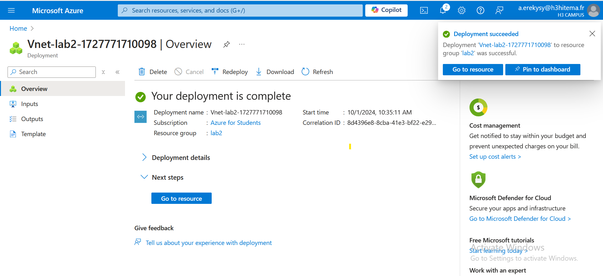
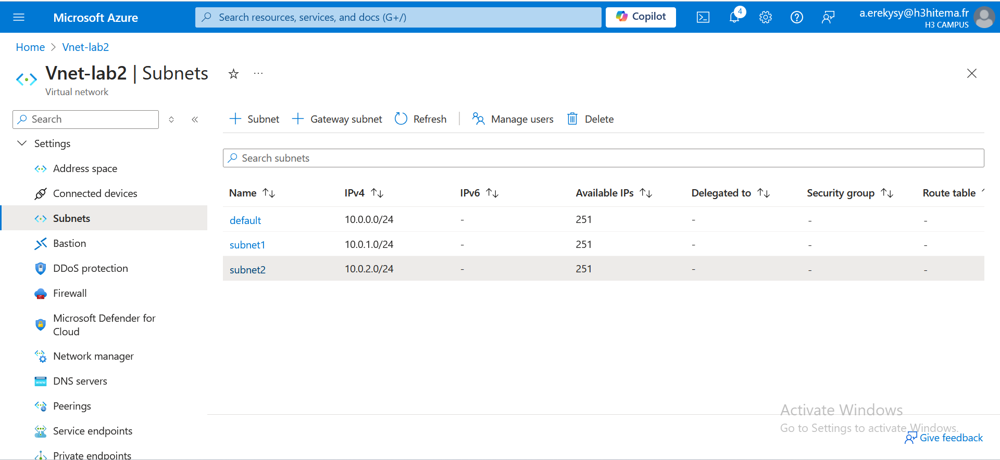
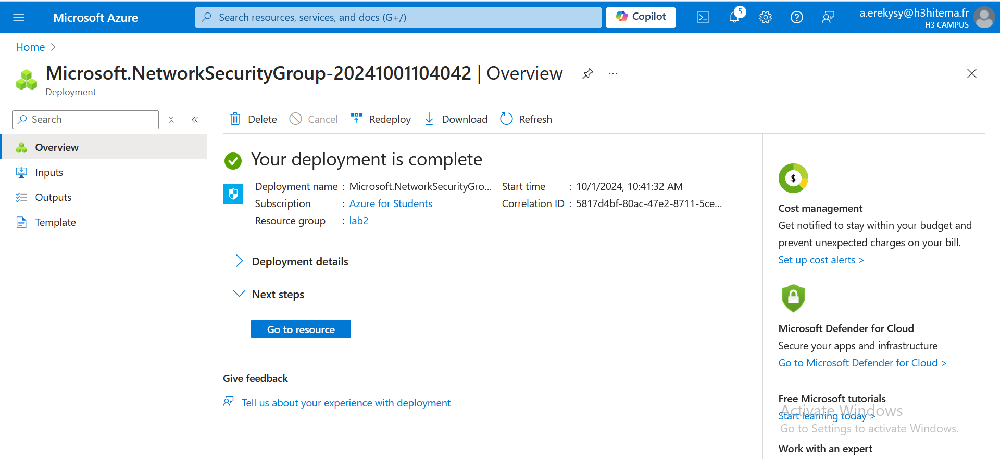
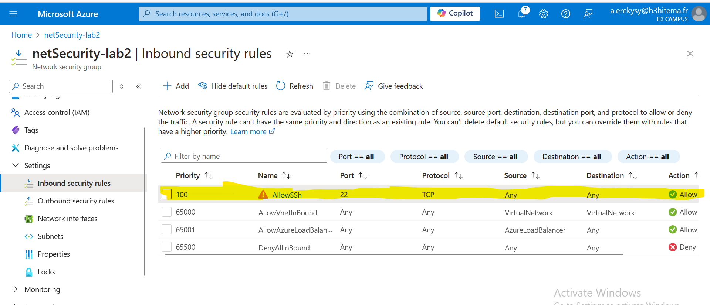
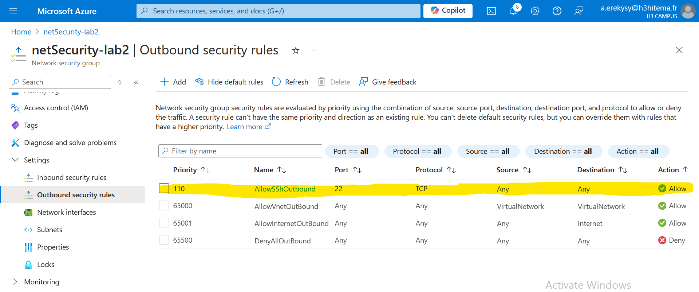

# Archi-Cloud-FINOPS-Course Lab2

## Steps

### Step 1: Create a Virtual Network (VNet) with Multiple Subnets

1. **Create a Virtual Network**:
   - Click **Create a resource** > **Networking** > **Virtual Network**.
   
2. **Add Subnets**:
   - Go to the **Subnets** tab.
   - Click **+ Subnet** to add subnets
   

### Step 2: Set Up Network Security Groups (NSGs)

1. **Create a Network Security Group**:
   - Click **Create a resource** > **Networking** > **Network Security Group**.
   
2. **Configure Inbound and Outbound Rules**:
   - Go to the NSG resource, click on **Inbound security rules**, and add rules (e.g., allow SSH on port 22).
   
3. **Associate NSG with Subnets**:
   - Go to your VNet, select a subnet, and associate it with the NSG.
   

### Step 3: Deploy VMs into Specific Subnets

 - working on it 

