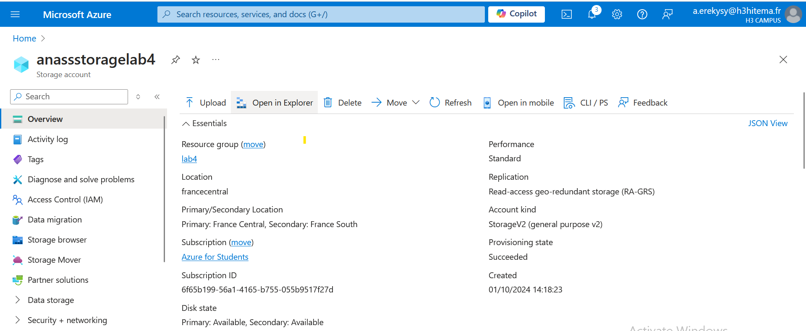
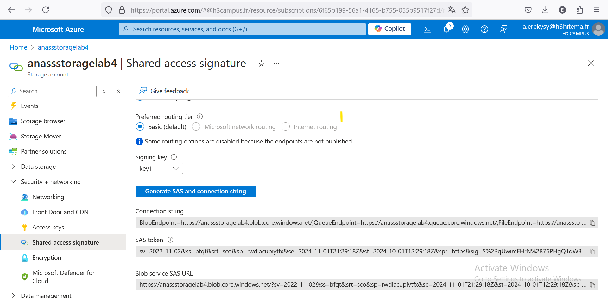

# Archi-Cloud-FINOPS-Course Lab4 

## steps 

## **Step 1: Create a Storage Account with Different Replication Options**

1. **Create a Storage Account:**
   - Click on **Create a resource** > **Storage** > **Storage account**.
    

## **Step 2: Upload and Manage Blobs Using Azure Portal**

1. **Navigate to Your Storage Account:**
   - In the Azure portal, locate and click on your newly created storage account.

2. **Create a Blob Container:**

3. **Upload a Blob:**
   

## **Step 3: Set Up Shared Access Signatures (SAS) for Secure Access**

1. **Generate a SAS Token:**
   - In the left sidebar, under **Security + networking**, click on **Shared access signature**.
   - Set the required permissions (e.g., Read, Write, List).
   - Set the expiry date/time for the SAS token.
   - Click **Generate SAS and connection string**.
    


## **Step 4: Implement Lifecycle Management Policies Using Azure CLI**


1. **Set Variables for Storage Account:**
   - Set the following environment variables:
     ```bash
     STORAGE_ACCOUNT_NAME=anassstoragelab4
     RESOURCE_GROUP=lab4
     ```

2. **Create a Lifecycle Policy (JSON):**
   - Define the lifecycle policy in a JSON file (e.g., `lifecycle_policy.json`):
     ```json
     {
       "rules": [
         {
           "name": "move-to-cool",
           "filters": {
             "blobTypes": ["blockBlob"],
             "minAge": "30"
           },
           "actions": {
             "baseBlob": {
               "tierToCool": {
                 "daysAfterModificationsGreaterThan": 30
               }
             }
           }
         },
         {
           "name": "delete-blobs",
           "filters": {
             "blobTypes": ["blockBlob"],
             "minAge": "365"
           },
           "actions": {
             "baseBlob": {
               "delete": {
                 "daysAfterModificationsGreaterThan": 365
               }
             }
           }
         }
       ]
     }
     ```

3. **Apply the Lifecycle Management Policy:**
   - Apply the lifecycle policy using the following command:
     ```bash
     az storage account management-policy create \
     --account-name $STORAGE_ACCOUNT_NAME \
     --resource-group $RESOURCE_GROUP \
     --policy @lifecycle_policy.json
     ```


    - still working on it !!
