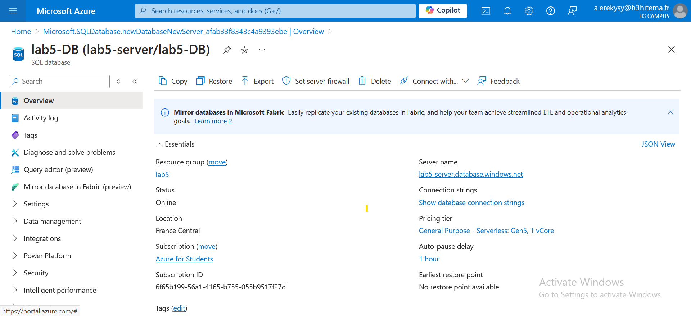
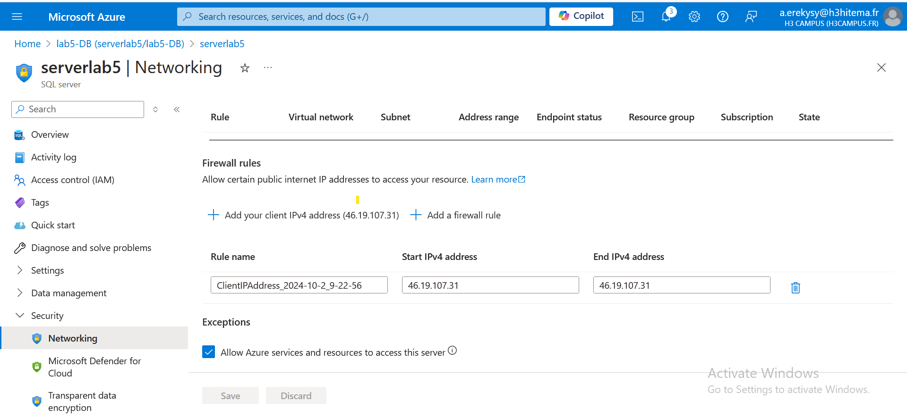
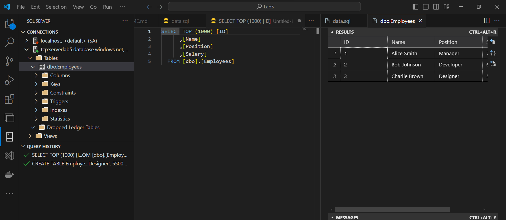
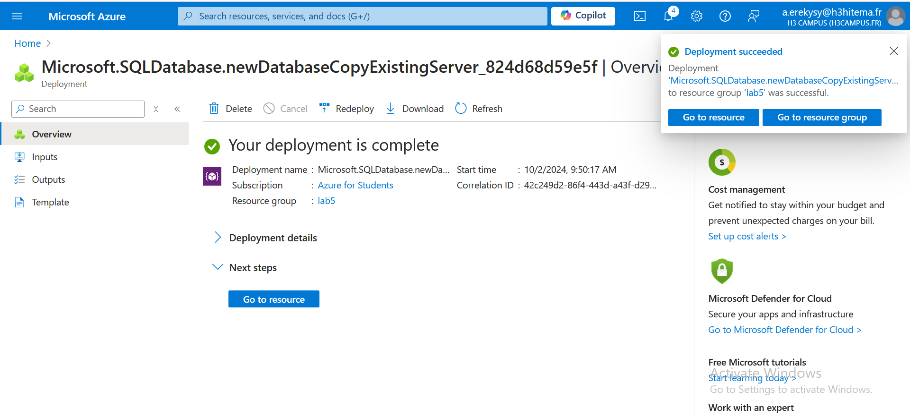

# Archi-Cloud-FINOPS-Course Lab5

## Steps

### 1. Deploy an Azure SQL Database Instance


1. **Create a SQL Database**:
   - Click on **Create a resource** > **Databases** > **SQL Database**.
   

### 2. Configure Firewall Settings to Allow Client Access

1. **Navigate to Your SQL Server**:
   - In the Azure portal, navigate to **SQL Servers** > select your server.

2. **Set Up Firewall Rules**:
   - Under **Security + networking**, click on **Firewalls and virtual networks**.
   - Click **Add client IP** to automatically add your current IP address for access.
   - You can also manually add IP ranges if necessary.
   - Click **Save** to apply the firewall rules.
   


### 3. Import Data into the Database
1. **Connect to Azure SQL Database via VS Code using mssql extension**:
   - download mssql extension in your vs code.
   - click connect then add this connection string (you can got it from the Azure Portal)
      ```bash
      Server=tcp:serverlab5.database.windows.net,1433;Initial Catalog=lab5-DB;Persist Security Info=False;User ID=anass;Password={your_password};MultipleActiveResultSets=False;Encrypt=True;TrustServerCertificate=False;Connection Timeout=30;
   - in your VS code open your Data's file then click ctrl+shift+E to fill the data base
   

### 4. Implement Geo-replication for High Availability

1. **Enable Geo-replication**:
   