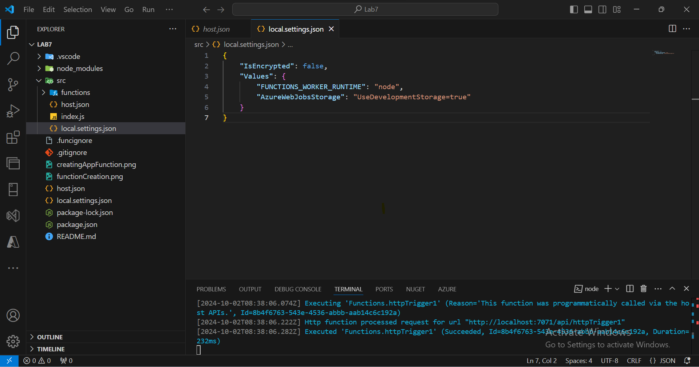
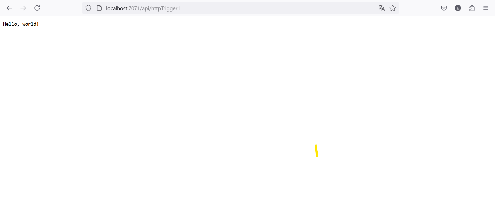

# Archi-Cloud-FINOPS-Course lab7

# steps

## 1. Create an Azure Function App


#### Prerequisites:
- Install the [Azure Functions extension](https://marketplace.visualstudio.com/items?itemName=ms-azuretools.vscode-azurefunctions).
- Ensure you have the [Azure CLI](https://docs.microsoft.com/en-us/cli/azure/install-azure-cli) installed.

1. **Sign in to Azure**:
   - Click on the **Azure** icon in the Activity Bar.
   - Click on **Sign In to Azure...** and follow the prompts to authenticate.

2. **Create a New Project**:
   - Click on the **Azure Functions** icon in the Azure sidebar.
   - Click on the **Create New Project** button.
   - Choose a location for your project.
   - Select a language for your function (JavaScript).
   - Choose a template for the function (e.g., HTTP Trigger).
   - Provide a name for your function and any other required parameters.

4. **Configure Function App Settings**:
   - Open the generated `local.settings.json` file.
   - Add any necessary settings, such as connection strings for Azure Storage.

5. **Deploy the Function App**:
   - Right-click on the project in the Azure sidebar and select **Deploy to Function App**.
   - Follow the prompts to create a new Function App in Azure.
   - Choose your subscription, resource group, and other settings as required.


## 2. Develop a Serverless Function Triggered by an HTTP Request

### Creating the HTTP Trigger:

### Write Function Code

1. **Open the Function Code**:
   - In your VS Code project, navigate to the generated function code file (e.g., `__init__.py` for Python).

2. **Write a Simple HTTP Function**:
   - Replace the code with the following sample (Python example):
   ```JavaScript
        const { app } = require('@azure/functions');
        app.http('httpTrigger1', {
            methods: ['GET', 'POST'],
            authLevel: 'anonymous',
            handler: async (request, context) => {
                context.log(`Http function processed request for url "${request.url}"`);

                const name = request.query.get('name') || await request.text() || 'world';

                return { body: `Hello, ${name}!` };
            }
        });
3. **Test the function**:
    - run this commande :
        ```bash
        func start



---

## 3. Integrate the Function with Azure Storage or Azure Queue

1. **Create function.json file in the directory where you have your function**:
   ```Json
    {
        "bindings": [
            {
                "type": "httpTrigger",
                "direction": "in",
                "authLevel": "anonymous",
                "methods": ["get", "post"]
            },
            {
                "type": "blob",
                "direction": "out",
                "name": "outputBlob",
                "path": "my-container/{rand-guid}.txt",
                "connection": "AzureWebJobsStorage"
            }
        ]
    }

2. **Update the function**:
    ```JavaScript
    const { app } = require('@azure/functions');

    app.http('httpTrigger1', {
        methods: ['GET', 'POST'],
        authLevel: 'anonymous',
        handler: async (request, context) => {
            context.log(`Http function processed request for url "${request.url}"`);

            const name = request.query.get('name') || await request.text() || 'world';

            context.bindings.outputBlob = `Hello, ${name}!`; // Save content to blob
            return { body: `Hello, ${name}, your data was saved to blob!` };
        }
    });

