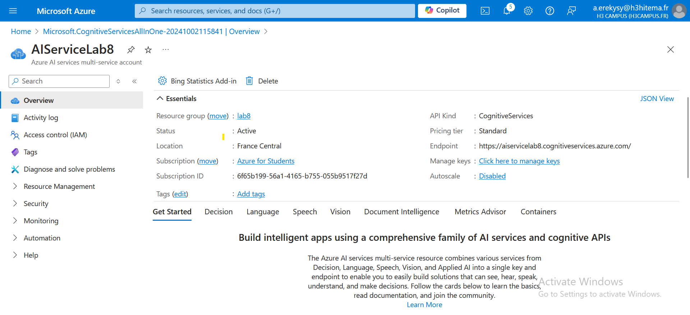
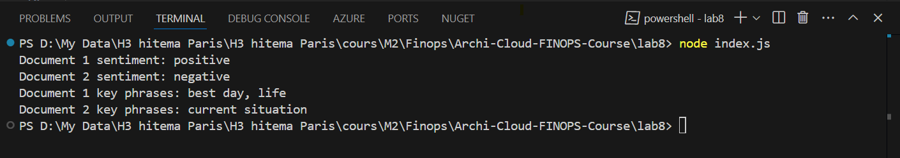

# Archi-Cloud-FINOPS-Course Lab8

## Step 1: Create a Cognitive Services Resource


1. **Create a new resource**:
   - Click on **Create a resource** > **Cognitive Services** > **Create**.
    

## Step 2: Develop an Application that Uses the Text Analytics API

1. **Create a New Node.js Application**

- Open your terminal or command prompt.

    ```bash
    mkdir text-analytics-app
    cd text-analytics-app
    ```
- Initialize a new Node.js project:

    ```bash
    npm init -y
    ```
2. **Install the Required Packages**

- Install the `@azure/ai-text-analytics` package:

    ```bash
    npm install @azure/ai-text-analytics axios
    ```

3. **Create an `index.js` File**

In your project directory, create a file named `index.js`.

4. **Add the Following Code to `index.js`**

    ```javascript
    const { TextAnalyticsClient, AzureKeyCredential } = require('@azure/ai-text-analytics');

    const endpoint = "https://<your-cognitive-service-name>.cognitiveservices.azure.com/";//AIServiceLab8
    const apiKey = "<your-cognitive-service-key>"; //10bbddf9ca524ef9b5c9b2be64972a81

    const textAnalyticsClient = new TextAnalyticsClient(endpoint, new AzureKeyCredential(apiKey));

    async function analyzeText() {
        const documents = [
            "I had the best day of my life. This is so good!",
            "I am so sad and unhappy with my current situation."
        ];
        const sentimentResult = await textAnalyticsClient.analyzeSentiment(documents);
        sentimentResult.forEach((result, index) => {
            console.log(`Document ${index + 1} sentiment: ${result.sentiment}`);
        });
        const keyPhrasesResult = await textAnalyticsClient.extractKeyPhrases(documents);
        keyPhrasesResult.forEach((result, index) => {
            console.log(`Document ${index + 1} key phrases: ${result.keyPhrases.join(', ')}`);
        });
    }

    analyzeText().catch(err => {
        console.error("The following error occurred:", err);
    });

## Step 3: Analyze Sentiment and Key Phrases

1. **Run the code**
    ```bash
    node index.js



